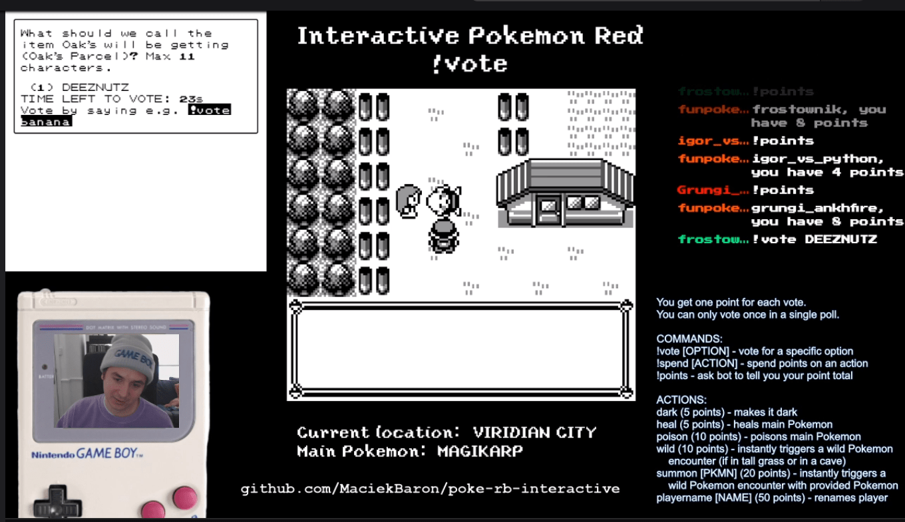

Interactive Twitch Pokémon Red/Blue (Chat vs Pokémon Red)
===================================

This is a Python application that allows you to play 1st generation Pokémon
games while your Twitch viewers influence the game by voting. Viewers can help
or hinder the player's progress.

***This is not a "Twitch Plays Pokémon" implementation.***

***This project is not affiliated with Nintendo or Game Freak. Pokémon character
names are trademarks of Nintendo.***

The application consists of several layers:
  * [PyBoy](https://github.com/Baekalfen/PyBoy) - Python GameBoy emulator
  * Twitch Bot - responsible for accepting votes and commands
  * Web layer - displays polls and results; this can be further divided into the
  web server, websocket server and JavaScript layers. The web app is a simple
  Vue.js application.
  * Core application - manages game modification
  * State tracker - outputs state txt files into the state folder (which can be)
  used to display information on the screen when streaming.

Installation
============
In order to run the application, you need to follow a few setup steps.

Dependencies
------------
  * Python 3 + pip
  * Your own ROM dump of Pokémon Red or Blue

Setup
-----
1. [Install PyBoy and SDL2](https://github.com/Baekalfen/PyBoy/wiki/Installation)
following the official instructions
2. Clone or download this repository
3. Install dependencies with `pip install -r requirements.txt` (you can first
optionally setup a virtual environment)
4. Duplicate `config.ini.example` and rename it to `config.ini` to create your
main configuration file
5. Make an account on Twitch that will function as your bot
6. [Request an oauth code](https://twitchapps.com/tmi/) and set it as the
`IRCToken` in your configuration file
7. [Register an app with Twitch Dev](https://dev.twitch.tv/console/apps/create)
in order to get a client id. Add it in your configuration file as `ClientId`.
8. Set the remaining configuration values: `Nick` should be your bot's nickname,
`Channel` the name of your channel (usually your Twitch username) and `Prefix`
which will be used for your chat commands (`!` by default)
9. Copy your ROM file into the folder, and set the `FileName` in the config file
10. If you update the WebSockets port in the config file, update it in the JS
file too!

Running the app
===============
Once you have completed the inital setup, you are ready to launch the application:

    python app.py

Several things will happen here: PyBoy will launch the game, local web and websocket
servers will launch on port `8888` and `8765` respectively, and your Twitch bot will
come online. You should see a message on Twitch indicating its readiness.

You can now display the current poll by going to `http://localhost:8888`. If you
use OBS Studio, you can setup a Web View that displays that page as part of your
layout.

Polls
-----
While you play the game, several different polls will be presented to your
viewers. There are two main types of polls: **overworld** and **battle** polls.
Each viewer can vote once in one poll, but can vote in as many polls as they
want. Whenever someone casts a vote, they earn a **point**. Points can be spent
to instantly influence the game.

Votes are cast using the `!vote` command in chat, e.g. `!vote Cubone`.

Points
------
Points can be spent using the `!spend` command. Currently, the following actions
are supported:

  * `dark` (5 points) - makes it dark in the current area
  * `heal` (5 points) - heals main Pokémon
  * `poison` (10 points) - poisons the first Pokémon in the party
  * `wild` (10 points) - triggers a wild Pokémon battle (when in tall grass /
  inside a cave)
  * `summon [PKMN]` (20 points) - summons a specific Pokémon (when in tall grass
  / inside a cave)
  * `playername [NAME]` (50 points) - changes the Player's name to `[NAME]`

It's a good idea to display the above as part of your layout so that viewers
know what they can do and how much everything costs. They can also check how
many points they've acrued by using the `!points` command.

Contributing
============
This is a very early version of the project, and therefore the codebase isn't
the cleanest. If you would like to contribute, feel free to send a pull request.

If you're thinking about doing some code restructuring, it's best if you first
discuss that by creating an issue on GitHub.

A lot things were quickly put together, especially the web part because it only
needs to run locally, so not many optimisations have been considered.

License
=======
GNU Lesser General Public License
